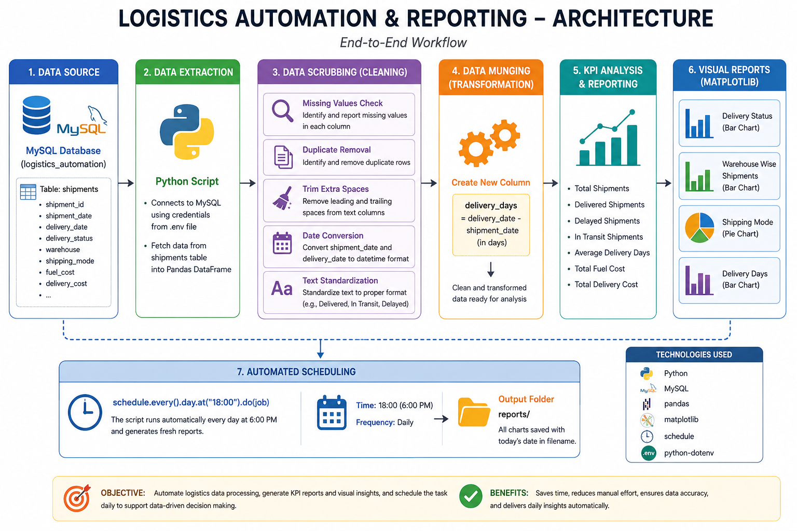

# Logistics Automation & Reporting

## 📌 Project Overview

A Python and MySQL based logistics data automation and reporting project.

The project automatically fetches shipment data from MySQL, performs data cleaning and transformation using Pandas, and generates business reports and visualizations using Matplotlib.

## 🛠️ Technologies Used

- Python
- MySQL
- Pandas
- Matplotlib
- MySQL Connector
- Schedule

## 🔄 Automation Workflow

1. Connect to the MySQL database.
2. Fetch shipment data from the `shipments` table.
3. Convert and standardize date columns.
4. Perform data cleaning and transformation.
5. Analyze shipment data using Pandas.
6. Generate visual reports using Matplotlib.
7. Save reports with date-based filenames.
8. Schedule the process for automated execution.

## 📊 Reports Generated

- Shipping Mode Analysis
- Shipment Performance Analysis
- Business Insights from Shipment Data

## 🎯 Key Learning Outcomes

- Python data processing
- Pandas data cleaning
- MySQL database connectivity
- Data transformation
- Data visualization
- Automation and scheduling
- Business reporting


  ## 🏗️ Project Architecture




## 📁 Project Structure

```text
logistics-automation/
│
├── .env.example
├── README.md
├── logistics_automation_architecture.png
├── logistics_automation_report.py
└── requirements.txt
